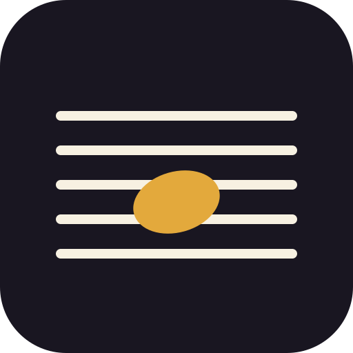

<p align="center">
  
</p>

# Klaviearn 🎹

**Learn to sight read piano music — designed accessibility-first for low-vision musicians.**

*Klavier* (German for piano) + *learn*.

Standard sheet music is an accessibility problem: thin black lines, tiny
noteheads, and the entire meaning of a note encoded in a millimeters-small
vertical position difference between a line and a space. Klaviearn treats
notation rendering as a variable, not a constraint — notes are drawn **huge,
high-contrast, and color/letter-scaffolded**, and the scaffolds fade
per-note as your recognition becomes automatic, driven by spaced repetition.
Think Duolingo, but the answer box is your piano.

## How it works

- **Short sessions** (3–5 min, ~10 exercises) with streaks, XP, and a skill
  tree: treble guide notes → full staff → ledger lines, with bass clef and
  rhythm as parallel tracks that merge into real micro sight-reading.
- **Your piano is the input.** USB-MIDI keyboards connect directly in the
  browser (Web MIDI); acoustic or non-connectable pianos work through
  microphone pitch detection; an on-screen keyboard covers everything else
  (including iOS, where Web MIDI doesn't exist).
- **Audio is a first-class channel.** Every state has a distinct sound, wrong
  answers play back what you played versus the target, and the app aims to be
  largely usable by ear.
- **Everything is tunable**: staff size, line thickness, note colors, themes.

The full design — visual scaffold system, curriculum, SRS engine,
architecture, roadmap — is in [DESIGN.md](DESIGN.md).

## Status

**Phases 1–4 built.** A FastAPI backend in [`server/`](server/) with
accounts, spaced repetition (SM-2 variant), per-note scaffold fading, XP and
day streaks, and a per-answer attempt log. The React PWA in [`web/`](web/)
works logged-in (server is the source of truth) or as an offline guest
(localStorage). Eleven skill nodes across six drills: note reading (treble,
bass, and grand staff), line-or-space discrimination, 4-note phrase reading,
interval recognition, and metronome rhythm tapping. A stats dashboard shows
your confusion matrix ("seeing C, you played D ×3") and per-note accuracy.

```bash
# API (Python 3.11 via asdf — see .tool-versions)
cd server
python3 -m venv .venv && .venv/bin/pip install -r requirements.txt
.venv/bin/uvicorn app.main:app --port 8787 --reload

# Web app (Node 24 — see .nvmrc; `nvm use` picks it up)
cd web
npm install
npm run dev
# open http://localhost:5173 in Chrome (Safari has no Web MIDI)
```

The original **Phase 0** proof-of-concept — a single dependency-free page —
lives in [`phase0/`](phase0/) and still works offline:

```bash
python3 -m http.server 8000 --directory phase0
```

## Planned stack

| Layer | Choice |
|-------|--------|
| Backend | Python — FastAPI + SQLAlchemy (SQLite → Postgres) |
| Frontend | React + Vite, shipped as a PWA for desktop and mobile |
| Notation | VexFlow (SVG, per-element styling for the scaffold system) |
| Piano input | Web MIDI (webmidi.js) · microphone pitch detection · on-screen keys |
| Audio | WebAudio + soundfont playback |

## License

[AGPL-3.0](LICENSE). The vendored `phase0/vexflow.js` is
[VexFlow](https://github.com/0xfe/vexflow), MIT-licensed by its authors.

## Roadmap

1. ~~**Phase 0** — proof-of-concept spike (notation + piano input + feedback)~~ ✅
2. ~~**Phase 1** — playable core: React app, note drills, settings, local progress~~ ✅
3. ~~**Phase 2** — learning engine: accounts, spaced repetition, skill tree, streaks~~ ✅
4. ~~**Phase 3** — rhythm + metronome, phrase reading, intervals, grand staff, PWA~~ ✅
5. ~~**Phase 4** — error-pattern stats (confusion matrix), mic input~~ ✅
6. **Next** — timed phrase reading against the metronome, hands-together grand
   staff phrases, real-repertoire excerpts, tempo/tolerance settings — all
   tuned by feedback from real practice.
